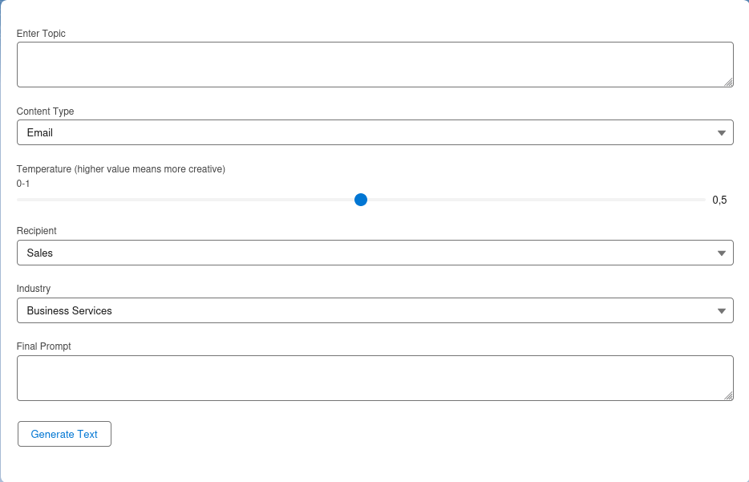

# Marketing Content Generator
## Overview
This project focuses on building a frontend Content Generator with the capabilities of GPT-4. This Content Generator is an innovative tool developed for Fluido Company to enhance content creation within Salesforce Marketing Cloud. Powered by GPT-4, it seamlessly integrates with Salesforce, streamlining workflows for users and providing an efficient way to generate marketing content.



## Setup
1. Set up Salesforce DX Environment:  <a href="https://developer.salesforce.com/tools/salesforcecli"> SalesForce CLI</a>.

2. Clone the repository:

   ```bash
   git clone https://github.com/hannemsalmi/content-generator-frontend.git

3. Navigate to the project directory:

   ```bash
   cd content-generator-frontend
  
4. Run Salesforce command to authenticate with your Salesforce org:

   ```bash
   sfdx force:auth:web:login
     
5. Run locally:

   ```bash
   sfdx force:lightning:lwc:start
    ```
The application will be accessible at `http://localhost:3333`.
    
6. Deploy the app with command  (replace myLwcComponent with the name of your component and myOrgAlias with the alias you set for your Salesforce org):

   ```bash
   sfdx force:source:deploy -p force-app/main/default/lwc/myLwcComponent -u myOrgAlias

# Features
## Input Parameters
The Content Generator accepts the following inputs to provide flexibility and customization for generating marketing content tailored to specific targets.

1. Enter Topic: Specify the main subject for the marketing content you want to generate.
2. Content Type (Dropdown List): Select the desired type of content tailored for specific platform
3. Temperature 0 - 1: Adjust and promotes more creative and diverse outputs of the content.
4. Recipient (Dropdown List): Select the relevant audience or recipient for the marketing content.
5. Industry (Dropdown List): Select the industry or sector for which the marketing content is generated.
6. Final Prompt: Provide the details for the content generation process.

## Usage
1. Access the Content Generator app within Salesforce.
2. Enter the required information in the input fields (topic, content type, temperature, recipient, industry).
3. Click on the "Generate Text" button to generate the marketing content text.
4. The generated content will be displayed below the button.
